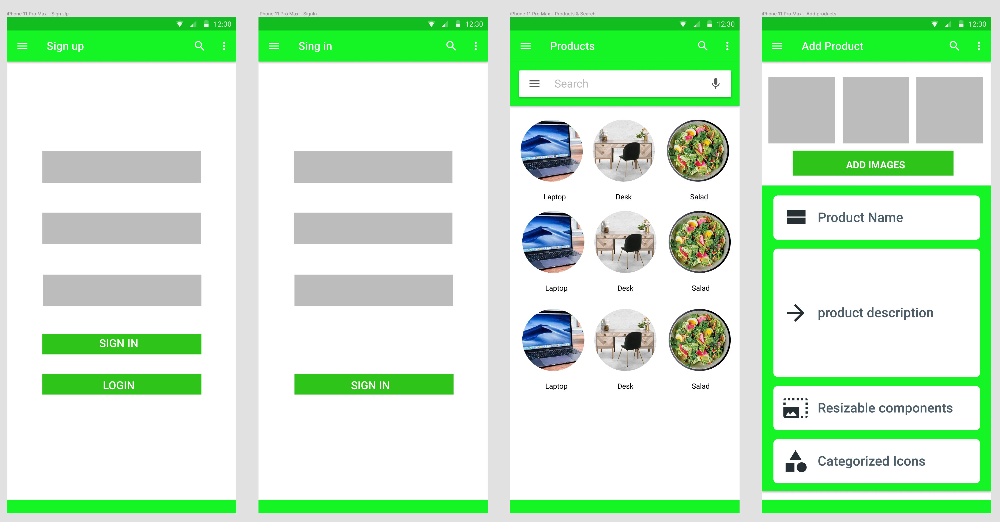
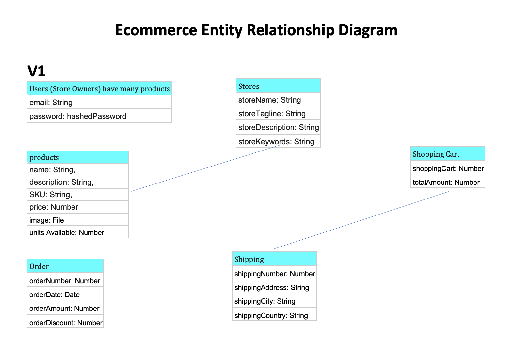

# gracelli app

## server side

# gracelli 

## shopping and eCommerce with a twist

# App Backend
[gracelli app server repository](https://github.com/mindmarine/gracelli-server)

# App Frontend repository
[gracelli heroku backend](https://gracelli.herokuapp.com/)

# Objective
Create a modern eCommerce website for sellers and a wonderful experience for customers

# Project Idea

eCommerce with a twist. This is at the intersection of etsy and amazon. It is like etsy in the sense it promotes smaller stores as well
Researched couple of ideas and came up with this. I'm trying to challenge myself.
Seeing how eCommerce is done can help me develop other projects.
User 1: Customers. They would use it for buying things they need while supporting the local economy or stores they care about
User 2: Store Owners. Expand their reach beyond their local appeal or footprint.

# User stories

Users (store owners) need to be able to add products to sale
Users (customers) need to be able to search for products and and them to the shopping cart
All users would need to be able to create an account, sign in, change passwords etc.

# Timetable

- Day 1 - > planning, 
- Day 2 - > server, API and routes
- Day 3 - > frontend and other aspects
- Day 4 - > UX

# Wireframe

# Entity Relationship Diagram

# Technologies used

Server side
- javascript
- MongoDB
- Mongoose
- Heroku platform
- github platform
  
# Backend Resources

### products
- name: String, 
- description: String, 
- sku: String, 
- price: Number
- image: File
- units: Number

### Shopping Cart
- shoppingCart: Number
- totalAmount: Number

### Stores
- storeName: String
- storeTagline: String
- storeDescription: String
- storeKeywords: String

### Order
- orderNumber: Number
- orderDate: Date
- orderAmount: Number
- orderDiscount: Number

### Shipping
- shippingNumber:  Number
- shippingAddress: String
- shippingCity: String
- shippingCountry: String

## Routing & versions

### v1
- user routes
- product routes
v2
- store routes
v3
- shopping cart
v4
- order
